# Olympic-History-ETL-with-SQL-and-SSIS
A project to integrate and analyze historical Olympic data using Microsoft SQL Server and SSIS through an ETL processes.

---
## Quick Peak
`select TOP 3 * from Olympic_Games_Medal_Tally;`

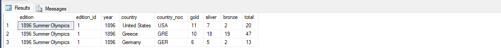

`select TOP 3 * from Olympic_Athlete_Event_Results;`

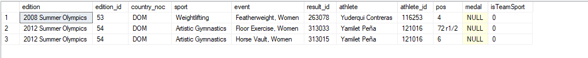

`select TOP 3 * from Olympic_Athlete_Bio;`

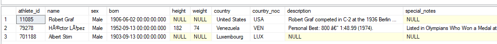

`select TOP 3 * from Olympic_Results;`

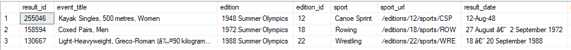

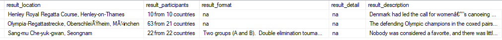

`select TOP 3 * from Olympics_Country;`

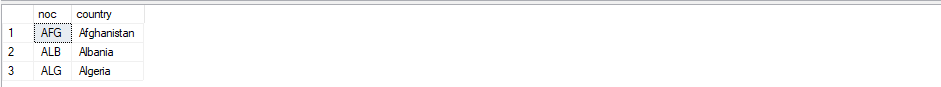

`select TOP 3 * from Olympics_Games;`

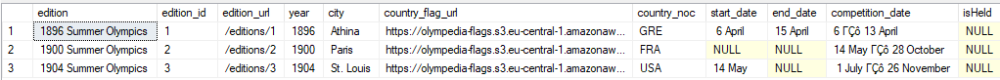

## SQL Documentation

This query creates a new table to store the average height and weight of athletes by country.
```sql
-- 1⦁ Create a new table to store the average height and weight of athletes by country.
create table Athlete_Avg_Stats(
	country_noc NVARCHAR(3),
	avg_height float,
	avg_weight float
);
```

This query retrieves all records from the `Olympics_Country` table.
```sql
-- 2⦁ Insert a new record into the Olympics_Country table for a newly recognized country.
-- The noc is ‘NEW’ and the country is ‘Newland’.
select * from Olympics_Country;
```

This query inserts a new record for a newly recognized country with the NOC code 'NEW' and the country name 'Newland' into the `Olympics_Country` table.
```sql
insert into Olympics_Country values ('NEW', 'Newland');
```

This query finds all distinct sports from the `Olympic_Results` table where the number of participants is greater than 20.
```sql
-- 3⦁ Find all distinct sports from the Olympic_Results table where the number of participants is greater than 20.
select distinct(sport) from Olympic_Results
where cast(substring(result_participants, 1, 2) as int) > 20;
```


This query classifies athletes' performance in `Olympic_Athlete_Event_Results` as 'Winner', 'Runner-up', 'Finalist', or 'Participant' based on their position.
```sql
-- 4⦁ Classify athletes' performance in Olympic_Athlete_Event_Results based on their position.
select edition, pos, country_noc, sport, event,
case 
    when TRY_CAST(pos AS INT) = 1 then 'Winner'
    when TRY_CAST(pos AS INT) = 2 then 'Runner-Up'
    when TRY_CAST(pos AS INT) <= 8 then 'Finalist'
    else 'Participant' 
end as classification
from Olympic_Athlete_Event_Results
where TRY_CAST(pos AS INT) IS NOT NULL;
```
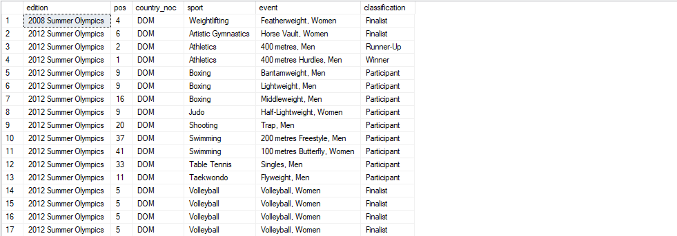

This query retrieves the top 10 events with the most participants, ordered by the number of participants in descending order.
```sql
-- 5⦁ Retrieve the top 10 events with the most participants, ordered by the number of participants in descending order.
select TOP 10 result_id, event_title, edition, sport, result_location, result_participants 
from Olympic_Results
order by cast(substring(result_participants, 1, 2) as int) desc;
```
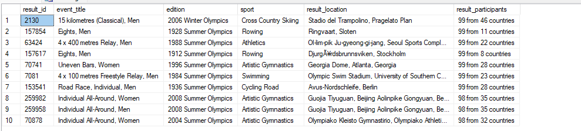

This query retrieves the top 5 athletes who have won the most medals.
```sql
-- 6⦁ Get the top 5 athletes who have won the most medals.
select TOP 5 athlete, count(*) as medalCount 
from Olympic_Athlete_Event_Results 
where pos = '1' 
group by athlete 
order by medalCount desc;
```
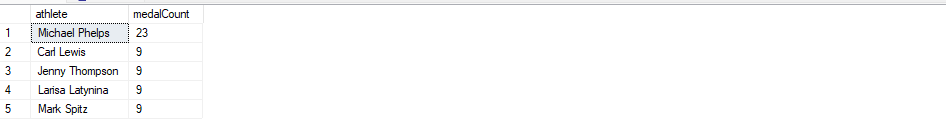

This query replaces null values in the description column of `Olympic_Athlete_Bio` with 'No description available'.
```sql
-- 7⦁ Replace null values in the description column of Olympic_Athlete_Bio with 'No description available'.
select name, sex, height, weight, coalesce(description, 'No description available') 
from Olympic_Athlete_Bio;
```
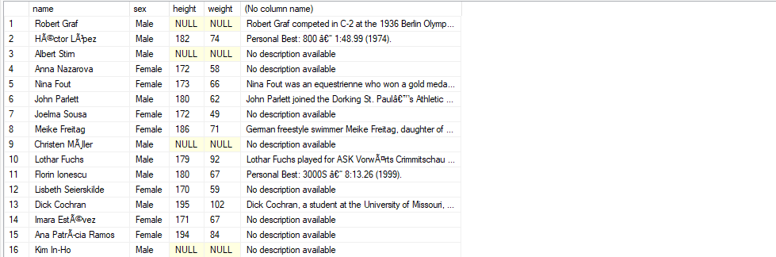

This query converts the born date in `Olympic_Athlete_Bio` to the year only and gives an alias ‘birth_year’.
```sql
-- 8⦁ Convert the born date in Olympic_Athlete_Bio to the year only and give an alias ‘birth_year’.
select year(born) as birth_year 
from Olympic_Athlete_Bio;
```
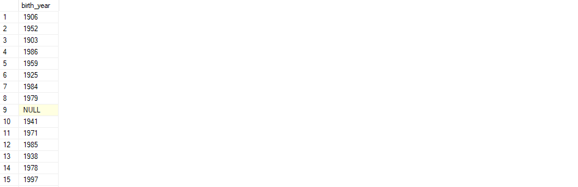

This query retrieves the athlete name and their country in one column.
```sql
-- 9⦁ Retrieve the athlete name and their country in one column.
select concat(name, ' and ', country) 
from Olympic_Athlete_Bio;
```
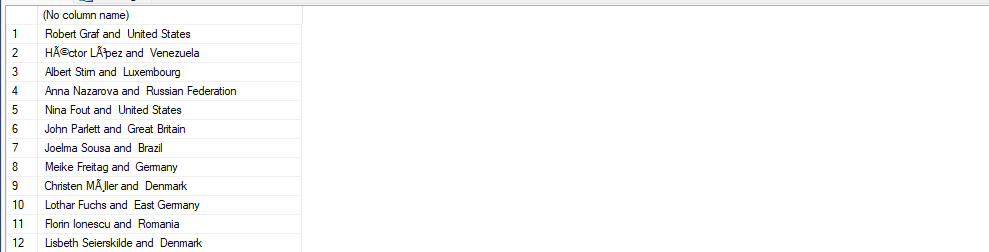

This query retrieves the first three letters of the athletes' names in uppercase.
```sql
-- 10⦁ Retrieve the first three letters of the athletes' names in uppercase.
select upper(substring(name, 1, 3)) as upper_nicknames 
from Olympic_Athlete_Bio;
```


This query finds the current date and time of the server.
```sql
-- 11⦁ Find the current date and time of the server as current_datetime.
select getdate() as current_datetime;
```
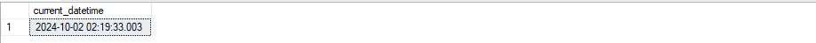
This query creates a new table called `Country_Medal_Count` with the total number of medals won by each country and inserts the data.
```sql
-- 12⦁ Create a new table called ‘Country_Medal_Count’ with the total number of medals won by each country and insert the data.
create table country_medal_count (
    medal_count int,
    country nvarchar(100)
);
insert into country_medal_count (country, medal_count)
select country, sum(total)
from olympic_games_medal_tally
group by country;
select top 10 * from country_medal_count; 
```
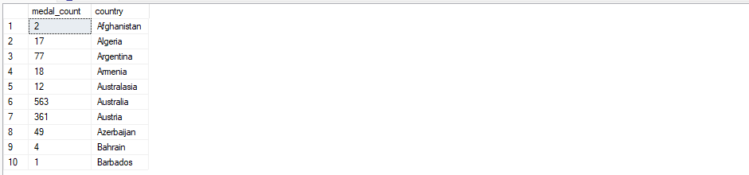

This query finds the total number of medals won by each country that has won more than 10 medals.
```sql
-- 13⦁ Find the total number of medals won by each country that has won more than 10 medals.
select country, sum(total) as total_medals 
from olympic_games_medal_tally
group by country 
having sum(total) > 10;
```
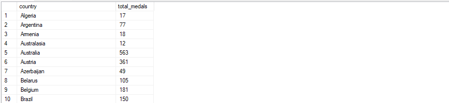

This query ranks athletes within each sport by the number of medals won.
```sql
-- 14⦁ Rank athletes within each sport by the number of medals won.
select athlete, sport, count(medal) as medal_count, 
    rank() over (partition by sport order by count(medal) desc) as medal_rank
from olympic_athlete_event_results
group by athlete, sport
order by sport, medal_rank;
```
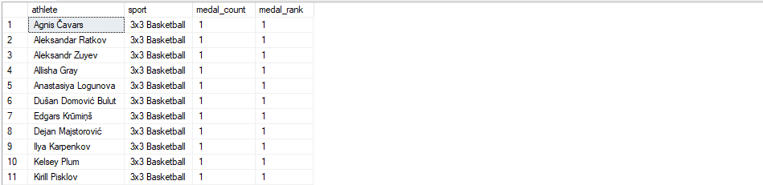

This query classifies countries based on total medals won as 'High', 'Medium', or 'Low'.
```sql
-- 15⦁ Classify countries based on total medals won as 'High', 'Medium', or 'Low'.
select country, total,
case
	when total > 50 then 'High'
	when total between 20 and 50 then 'Medium'
	else 'Other'
end as classification
from Olympic_Games_Medal_Tally;
```
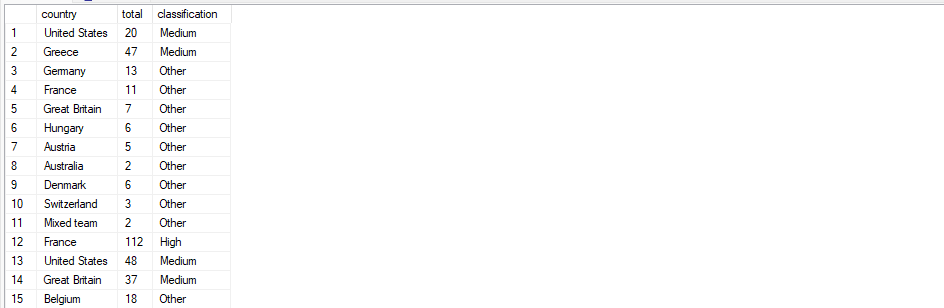

This query creates a stored procedure to get the medal tally for a specific country and year.
```sql
-- 16⦁ Create a stored procedure to get the medal tally for a specific country and year.
create proc get_medal_tally 
    @country varchar(255), 
    @year int
as 
begin
    select * 
    from olympic_games_medal_tally
    where year = @year and country = @country;
end;

exec get_medal_tally 'Switzerland', 1896;
```


This query creates a stored procedure to store the total number of medals won by a specific country (e.g., ‘USA’) in a variable.
```sql
-- 17⦁ Store the total number of medals won by a specific country in a variable.
create proc get_country_medl_tally 
    @country varchar(255)
as 
begin
    select total 
    from olympic_games_medal_tally
    where country = @country or country_noc = @country;
end

exec get_country_medl_tally 'Brazil';
```
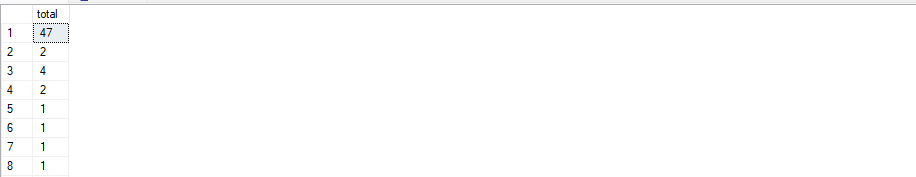

This query checks if a country has won more than 50 medals and prints the country name with 'High Medal Count' if true, otherwise prints 'Low Medal Count'.
```sql
-- 18⦁ -- 18⦁Create a dynamic SQL statement to retrieve medal data for a specific sport
CREATE PROCEDURE get_Medal_Data_For_Sport
    @SportName NVARCHAR(255)  
AS
BEGIN
    DECLARE @SQL NVARCHAR(MAX);  

    SET @SQL = N'SELECT athlete, country_noc, sport, medal
                 FROM Olympic_Athlete_Event_Results
                 WHERE sport = @Sport;'; 

    EXEC sp_executesql @SQL, N'@Sport NVARCHAR(255)', @Sport = @SportName;
END;

EXEC get_Medal_Data_For_Sport 'Weightlifting';
```

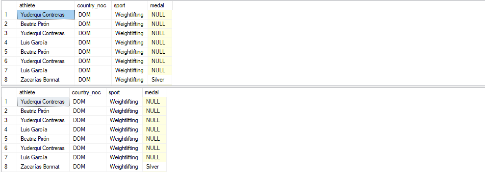

This query checks if a country has won more than 50 medals and prints the country name with '`High Medal Count`' if true; otherwise, it prints 'Low Medal Count'.
```sql
-- 19 ⦁ Check if a country has won more than 50 medals then print the country name and 
-- ‘High Medal Count’, if not, print ‘Low Medal Count’ behind the country name.
select 
    country,
    case
        when sum(total) > 50 then country + ' - high medal count'
        else country + ' - low medal count'
    end as medalcountstatus
from 
    olympic_games_medal_tally
group by 
    country;
```
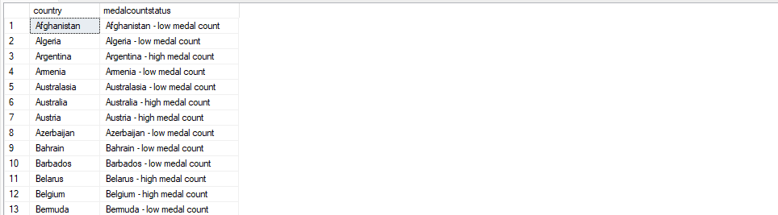

This query loops through each athlete in a list and prints their name along with their country.
```sql
-- 20 ⦁ Loop through each athlete in a list and print their name along with their country.
declare @athletename nvarchar(255);
declare @country nvarchar(255);

declare athletecursor cursor for
    select name, country
    from olympic_athlete_bio;

open athletecursor;

fetch next from athletecursor into @athletename, @country;

while @@fetch_status = 0
begin
    print 'athlete: ' + @athletename + ', country: ' + @country;
    
    fetch next from athletecursor into @athletename, @country;
end;

close athletecursor;
deallocate athletecursor;
```


This query finds the athletes who have participated in more than one edition of the Olympics.
```sql
-- 21 find the athletes who have participated in more than one edition of the olympics.
select athlete 
from olympic_athlete_event_results
group by athlete
having count(distinct edition) > 1;
```
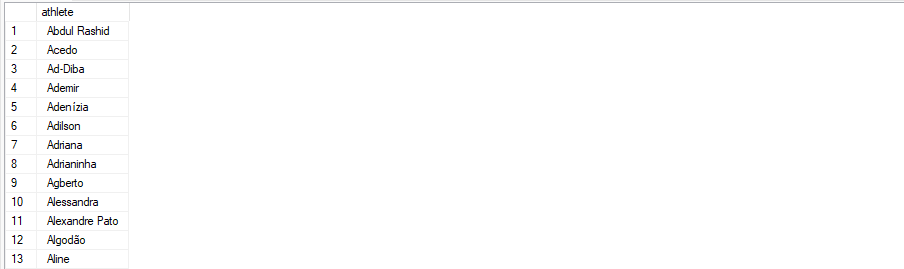

This query lists the athletes who have won medals in both summer and winter Olympics.
```sql
-- 22 list the athletes who have won medals in both summer and winter olympics.
select athlete, country_noc, count(distinct edition) as editions, 
       sum(case when medal is not null then 1 else 0 end) as total_medals
from olympic_athlete_event_results
where edition like '%summer%' or edition like '%winter%'
group by athlete, country_noc
having count(distinct case when edition like '%summer%' then edition end) > 0
   and count(distinct case when edition like '%winter%' then edition end) > 0;
```
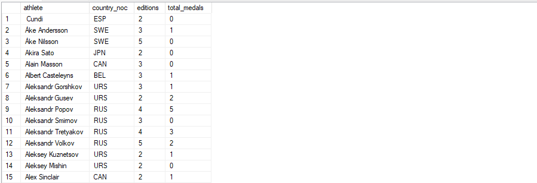

This query creates a stored procedure `update_athlete_info` that takes an athlete's ID, a column name, and a new value as input parameters, updating the specified column for the given athlete.
```sql
-- 23 create a stored procedure update_athlete_info that takes an athlete's id, 
-- a column name, and a new value as input parameters. 
-- It updates the specified column for the given athlete with the new value.
create procedure update_athlete_info
    @athleteid int,
    @columnname nvarchar(255),
    @newvalue nvarchar(255)
as
begin
    declare @sql nvarchar(max);

    set @sql = n'update olympic_athlete_bio set ' + quotename(@columnname) + ' = @value where athlete_id = @id';

    exec sp_executesql @sql, n'@value nvarchar(255), @id int', @value = @newvalue, @id = @athleteid;
end
```

This query creates a stored procedure `get_athletes_by_medal_type` that takes a medal type as an input parameter and dynamically generates a report of athletes who have won that type of medal.
```sql
-- 24 create a stored procedure get_athletes_by_medal_type that takes a medal 
-- type as an input parameter and dynamically generates a report of athletes who have won that type of medal.
create procedure get_athletes_by_medal_type
    @medaltype nvarchar(50)
as
begin
    declare @sql nvarchar(max);

    set @sql = n'select * from olympic_athlete_event_results where medal = @type';

    exec sp_executesql @sql, n'@type nvarchar(50)', @type = @medaltype;
end
```


